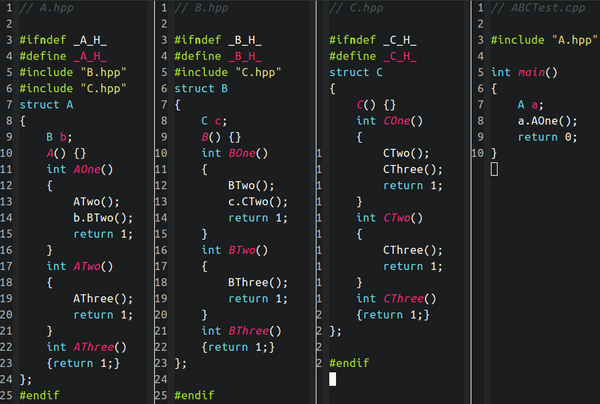
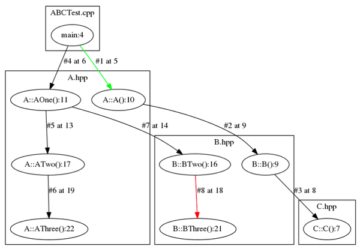

#<center>C++源码的调用图生成</center>
# 前言
之前受知乎用户mailto1587启发，写了个C++源码的调用图生成器，可以以图示法显示C++函数的调用关系，
代码放在了github仓库里，仅供参考：
CodeSnippet/python/SRCGraphviz/c++ at master · Cheukyin/CodeSnippet · GitHub

# 主要思路
利用gcc/g++的-finstrument-functions的注入选项，
得到每个函数的调用地址信息，生成一个trace文件，
然后利用addr2line和c++filt将函数名及其所在源码位置从地址中解析出来，
从而得到程序的Call Stack，
然后用pygraphviz画出来

# 使用示例
比如我现在有A.hpp、B.hpp、C.hpp、ABCTest.cpp这几个文件，
我想看他们的Call Graph

源码如下：


然后按下面编译(instrument.c在上面github地址中可以下载，用于注入地址信息）：
> g++ -g -finstrument-functions -O0 instrument.c ABCTest.cpp -o test

然后运行程序，得到trace.txt
> 输入shell命令./test

最后
> 输入shell命令python CallGraph.py trace.txt test

弹出一张Call Graph


图上标注含义:

* 绿线表示程序启动后的第一次调用
* 红线表示进入当前上下文的最后一次调用
* 每一条线表示一次调用，#符号后面的数字是序号，at XXX表示该次调用发生在这个文件（文件路径在框上方）的第几行
* 在圆圈里，XXX:YYY，YYY是调用的函数名，XXX表示这个函数是在该文件的第几行被定义的

# 获取C/C++调用关系
利用-finstrument-functions编译选项，
可以让编译器在每个函数的开头和结尾注入__cyg_profile_func_enter和 __cyg_profile_func_exit
这两个函数的实现由用户定义

在本例中，只用到__cyg_profile_func_enter，定义在instrument.c中，
其函数原型如下:
void __cyg_profile_func_enter (void *this_fn, void *call_site);
其中this_fn为 被调用的地址，call_site为 调用方的地址

显然，假如我们把所有的 调用方和被调用方的地址 都打印出来，
就可以得到一张完整的运行时Call Graph

因此，我们的instrument.c实现如下：

```cpp
/* Function prototypes with attributes */
void main_constructor( void )
	__attribute__ ((no_instrument_function, constructor));

void main_destructor( void )
	__attribute__ ((no_instrument_function, destructor));

void __cyg_profile_func_enter( void *, void * )
	__attribute__ ((no_instrument_function));

void __cyg_profile_func_exit( void *, void * )
	__attribute__ ((no_instrument_function));

static FILE *fp;

void main_constructor( void )
{
  fp = fopen( "trace.txt", "w" );
  if (fp == NULL) exit(-1);
}

void main_deconstructor( void )
{
  fclose( fp );
}

void __cyg_profile_func_enter( void *this_fn, void *call_site )
{
    /* fprintf(fp, "E %p %p\n", (int *)this_fn, (int *)call_site); */
    fprintf(fp, "%p %p\n", (int *)this_fn, (int *)call_site);
}
```

其中main_constructor在 调用main 前执行，main_deconstructor在调用main后执行，
以上几个函数的作用就是 将所有的 调用方和被调用方的地址 写入trace.txt中

然而，现在有一个问题，就是trace.txt中保存的是地址，我们如何将地址翻译成源码中的符号？
答案就是用addr2line

以上面ABCTest.cpp工程为例，比如我们现在有地址0x400974，输入以下命令
> addr2line 0x400aa4 -e a.out -f

结果为

```cpp
_ZN1A4AOneEv
/home/cheukyin/PersonalProjects/CodeSnippet/python/SRCGraphviz/c++/A.hpp:11
```

第一行该地址所在的函数名，第二行为函数所在的源码位置

然而，你一定会问，_ZN1A4AOneEv是什么鬼？
为实现重载、命名空间等功能，因此C++有name mangling，因此函数名是不可读的

我们需要利用c++filt作进一步解析：
> 输入shell命令 addr2line 0x400aa4 -e a.out -f | c++filt

结果是不是就清晰很多：

```cpp
A::AOne()
/home/cheukyin/PersonalProjects/CodeSnippet/python/SRCGraphviz/c++/A.hpp:11
```
注意这个结果中包含了函数名、函数所在文件和行号

# 调用图渲染
经过上面的步骤，我们已经可以把所有的(调用方, 被调用方)对分析出来了，相当于获取到调用图所有的节点和边，
最后可以用pygraphviz将 每一条调用关系 画出来即可，代码用python实现在 CallGraph.py 中