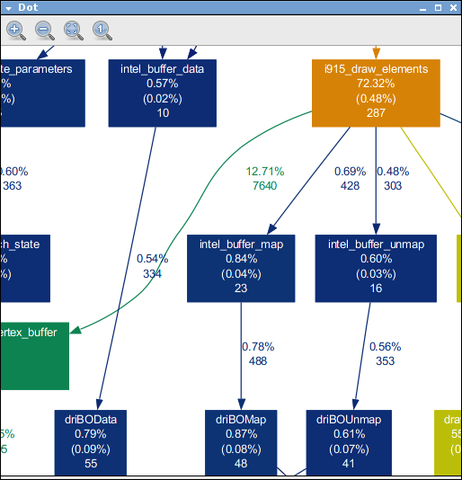
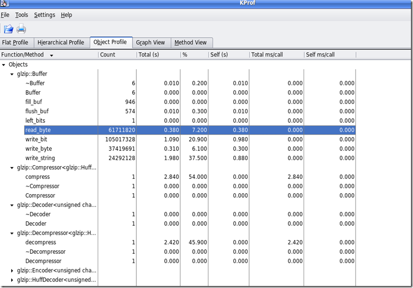

# [gprof + kprof + gprof2dot (性能 与 函数调用图）-](https://www.cnblogs.com/zengkefu/p/5570617.html)

http://www.cnblogs.com/rocketfan/archive/2009/11/15/1603465.html

http://blog.csdn.net/stanjiang2010/article/details/5655143

http://blog.csdn.net/stanjiang2010/article/details/5655143

[](javascript: "复制代码")

```plain
三种方案：

1.程序编绎加 -PG：
   g++ -pg -g  -o test test.cc
```

 **./test   //运行后生成gmon.out**

**     gprof ./test > prof.log**

** 2\. KProf 是gprof 版本//**//注意已经按照前面的用gprof生成 gmont.out 了****

**      **kprof -f ./test****

**** 3\. gprof2dot.py 与 xdot:生成图像清晰,相对于KProf****

**      gprof ./test | gprof2dot.py | xdot**

[](javascript: "复制代码")

[](javascript: "复制代码")

```plain
gprof：系统自带
https://sourceware.org/binutils/docs/gprof/
https://sourceware.org/binutils/
```

The GNU Binutils are a collection of binary tools. The main ones are:

*   **ld** \- the GNU linker.
*   **as** \- the GNU assembler.

But they also include:

*   **addr2line** \- Converts addresses into filenames and line numbers.
*   **ar** \- A utility for creating, modifying and extracting from archives.
*   **c++filt** \- Filter to demangle encoded C++ symbols.
*   **dlltool** \- Creates files for building and using DLLs.
*   **gold** \- A new, faster, ELF only linker, still in beta test.
*   **gprof** \- Displays profiling information.
*   **nlmconv** \- Converts object code into an NLM.
*   **nm** \- Lists symbols from object files.
*   **objcopy** \- Copies and translates object files.
*   **objdump** \- Displays information from object files.
*   **ranlib** \- Generates an index to the contents of an archive.
*   **readelf** \- Displays information from any ELF format object file.
*   **size** \- Lists the section sizes of an object or archive file.
*   **strings** \- Lists printable strings from files.
*   **strip** \- Discards symbols.
*   **windmc** \- A Windows compatible message compiler.
*   **windres** \- A compiler for Windows resource files.

[](javascript: "复制代码")

[](javascript: "复制代码")

```plain
kprofhttp:
//
kprof.sourceforge.net/        % tar xvfz kprof-1.4.1.tar.gz    	% cd kprof-1.4.1    	% ./configure --prefix=(where KDE is installed, for example /opt/kde3)    	% make    	% su    	enter your root password    	# make install
```

[](javascript: "复制代码")

[](javascript: "复制代码")

```plain
KProf is a visual tool for developers, which displays the execution profiling output generated by code profilers. 
The output of profilers being usually difficult to read (beyond the flat profile information), 
KProf presents the information in list- or tree-views that make the information very easy to understand.

KProf provides access to the following features:

    Flat profile view displays all function / methods and their profiling information.
    Hierarchical profile view displays a tree for each function / method with the other functions / methods it calls as subelements.
    Object profile view, for C++ developers, groups the methods in a tree view by object name.
    Graph view is a graphical representation of the call-tree, requires GraphViz to work.
    Method view is a more detailed look at an individual method - cross referenced.
    Recursive functions carry a special icon to clearly show that they are recursive.
    Right-clicking a function or method displays a pop-up with the list of callers and called functions. 
You can directly go to one of these functions by selecting it in the pop-up menu.
    The flat profile view provides an additional filter edit box to filter the display and show only the functions or methods
 containing the text that you enter.
    Function parameters hiding if the function name is unique (i.e. no different signatures)
    C++ template abbreviation (template parameters can be hidden)
    Automatic generation of call-graph data for GraphViz and VCG, two popular graph image generators.
    Diff mode support to compare two profile results.
```

[](javascript: "复制代码")

```plain
gprof2dot     (.txt----->.dot)

https://github.com/jrfonseca
```

```plain
xdot.py是 一个图形可交互查看器，采用Graphviz的 dot 语言开发      （DOT文件------>图像生成)

https://github.com/jrfonseca/xdot.py
```





分类: [linux内核](https://www.cnblogs.com/zengkefu/category/724359.html)

[好文要顶](javascript:) [关注我](javascript:) [收藏该文](javascript:) [](javascript: "分享至新浪微博") [](javascript: "分享至微信")

[zengkefu](https://home.cnblogs.com/u/zengkefu/)  
[关注 \- 1](https://home.cnblogs.com/u/zengkefu/followees/)  
[粉丝 \- 382](https://home.cnblogs.com/u/zengkefu/followers/)

[+加关注](javascript:)

0

0

[«](https://www.cnblogs.com/zengkefu/p/5570572.html) 上一篇： [/proc/sys/ 下内核参数解析](https://www.cnblogs.com/zengkefu/p/5570572.html "发布于 2016-06-08 16:42")  
[»](https://www.cnblogs.com/zengkefu/p/5571284.html) 下一篇： [高级性能调试手段(oprofile+gprofile)+内核追踪手段:LTT](https://www.cnblogs.com/zengkefu/p/5571284.html "发布于 2016-06-08 20:50")

posted @ 2016-06-08 16:51  [zengkefu](https://www.cnblogs.com/zengkefu/)  阅读(848)  评论(0)  [编辑](https://i.cnblogs.com/EditPosts.aspx?postid=5570617)  [收藏](javascript:)

---------------------------------------------------


原网址: [访问](https://www.cnblogs.com/zengkefu/p/5570617.html)

创建于: 2020-05-08 22:17:46

目录: default

标签: `www.cnblogs.com`

