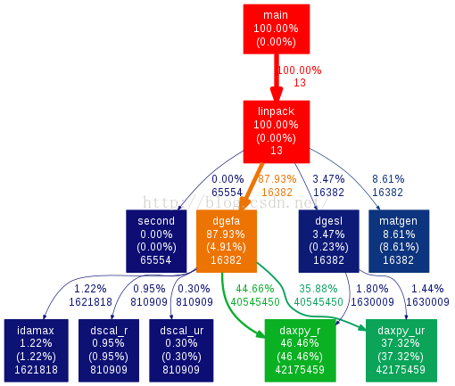
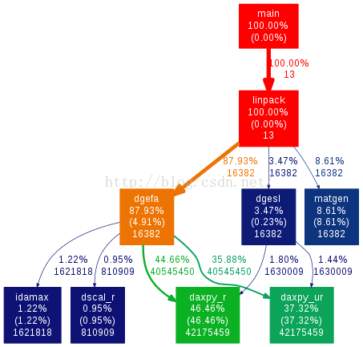

# gprof、gprof2dot.py、dot使用方法简介

  

[mazinkaiser1991](https://me.csdn.net/u012927281) 2016-04-12 12:18:23  8554   收藏 

展开

通过gprof可以有效的对调用结构，运行时间等时间进行统计，在当前工具链中已存在gprof工具。

1）gprof使用步骤如下，以linapck为例：

1 在编译过程中添加-pg选项，命令如下：

```css
gcc -pg linpack.c -o linpack_gprof
```

  
2 运行程序，运行结束之后会形成文件gmon.out，命令如下：

```undefined
./linpack_gprof
```

  
3 使用gprof再次执行程序，并将结果重定位到prof.log中，命令如下：

```vbscript
gprof ./linpack > prof.log
```

  
分析prof.log就可以获得程序的调用关系、函数执行时间等信息。对gprof的分析方法见以下blog

[http://blog.csdn.net/macky0668/article/details/6839517](http://blog.csdn.net/macky0668/article/details/6839517)  

  

2）以上方法仍然存在一个问题就是分析结果不够直观，特别是函数的调用关系。因此为解决以上问题，可以配合gprof2dot.py与dot工具的使用。

1 安装gprof2dot.py与dot

通过以下地址可获得gprof2dot.py

[http://jrfonseca.googlecode.com/svn/trunk/gprof2dot/gprof2dot.py](http://jrfonseca.googlecode.com/svn/trunk/gprof2dot/gprof2dot.py)

以上地址直接就给出了gprof2dot.py的内容，因此直接新建一个python文件并拷贝网页中的内容即可，拷贝完成后还需要改变python文件的权限

```css
chmod 744 gprof2dot.py
```

  

通过以下地址可获得graphviz，安装graphviz后可使用dot工具

[http://www.graphviz.org/Download_source.php](http://www.graphviz.org/Download_source.php)

安装方法如下：

```go
./configure
make
sudo make install
```

  
在使用上述工具前，还需要先产生gmon.out文件。gmon.out文件的产生方法见上文

通过以下命令即可得到函数调用图

```ruby
gprof ./linpack_gprof | ./gprof2dot.py -n0 -e0 |dot - Tpng -o output.png
```

结果如下：

  

还可通过以下命令得到函数调用图

```vbscript
gprof linpack_gprof > prof.log
./gprof2dot.py prof.log | dot -Tpng -o output.png
```

结果如下：

  

  

通过对比以上两种方法，可以发现第二种方法无法得到调用时间过短的函数调用关系

  

接上文补充几点可能无法产生gmon.out文件的情况：

  1，程序不是从main return或exit()退出，则可能不生成gmon.out。  
  2，程序如果崩溃，可能不生成gmon.out。  
  3，测试发现在虚拟机上运行，可能不生成gmon.out。  
  4，程序忽略SIGPROF信号！一定不能捕获、忽略SIGPROF信号。man手册对SIGPROF的解释是：profiling timer expired. 如果忽略这个信号，gprof的输出则是：Each sample counts as 0.01 seconds. no time accumulated.  
  5，如果程序运行时间非常短，则gprof可能无效。

[](https://blog.csdn.net/u012927281)

[mazinkaiser1991](https://blog.csdn.net/u012927281) 

原创文章 106获赞 28访问量 20万+

关注 [私信](https://im.csdn.net/im/main.html?userName=u012927281)

---------------------------------------------------


原网址: [访问](https://blog.csdn.net/u012927281/article/details/51132064)

创建于: 2020-05-08 22:13:48

目录: default

标签: `blog.csdn.net`

