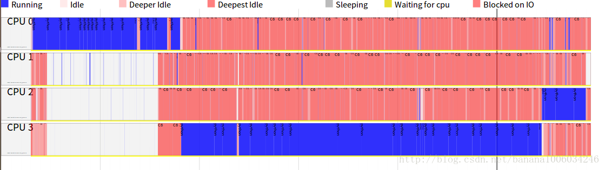
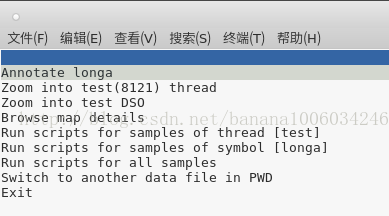
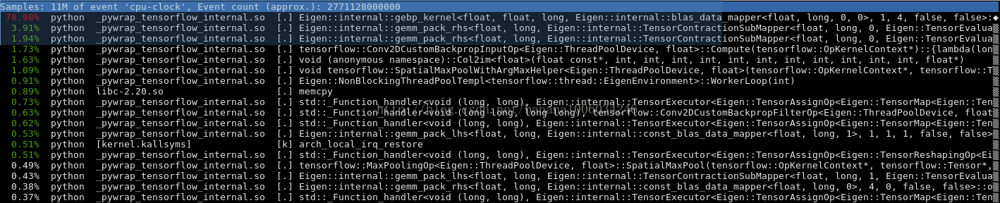
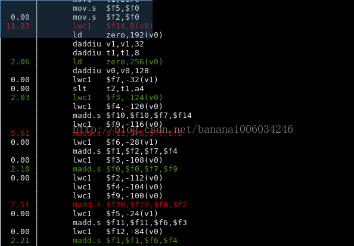
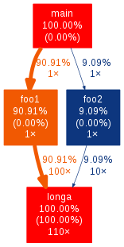

# perf+gprof+gprof2dot+graphviz进行性能分析热点

  

[banana10060342](https://me.csdn.net/banana1006034246) 2017-03-31 15:25:11  3342   收藏 

展开

*   ## perf分析热点代码
    

perf是linux的一款性能分析工具  
perf list            ;;列出平台中perf支持的事件命令  
sudo perf timechart record python conv2d.py   ;;各种统计信息图形化  
sudo perf timechart   ;;再执行，就会产生csv图形文件  

  

perf top -e cycles:pp        ;;采样数据，其中有四个级别  0--无精度保证  p--采样指令和触发性能事件之间的偏差为常数 pp--偏差尽量趋于零  ppp--偏差必须为零  
perf record -e cpu-clock ./test ;;结合report命令找出热点函数  
perf record -F 50000 -e cpu-clock ./test   ;;指定频率  
perf stat -r 10 ./test        ;;执行10次求均值  
perf record -g -e cpu-clock ./test    ;;调用关系显示  
perf report            ;;可多次回车选择不同的项观看，如图，第一个选项是对应热点的汇编代码  
  

perf stat ./test   ;;显示程序的cpu、预取、cache miss等  
perf record -e cpu-clock python cnn.py         ;;使用python执行卷积神经网络cnn.py  
perf report    ;;显示出来，回车再回车  

  

  

  

*   ## **作图显示热点图**  
    

请确保系统安装**python、gprof2dot、graphviz**软件包

Ubuntu：

$sudo apt-get install python graphviz  
$sudo pip install gprof2dot  
centos/redhat/fedora：  
$yum install python graphviz gprof2dot

以程序test.c为例进行演示

1.创建C文件  **test.c**

```cpp
void longa() 
 { 
   int i,j; 
   for(i = 0; i < 1000000; i++)//循环1百万次
 	  j=i;  
 } 
 void foo2() 
 { 
   int i; 
   for(i=0 ; i < 10; i++) 
        longa(); 
 } 
 void foo1() 
 { 
   int i; 
   for(i = 0; i< 100; i++) 
      longa(); 
 } 
 int main(void) 
 { 
   foo1(); 
   foo2(); 
 }
```

  

2\. 终端执行命令, -pg参数产生供gprof剖析用的可执行文件(会在每个function call 插入一个_mcount的routine 功能)  -g参数产生供gdb调试用的可执行文件。更多GCC参数可见这篇博客[http://blog.chinaunix.net/uid-21411227-id-1826747.html](http://blog.chinaunix.net/uid-21411227-id-1826747.html)  

> $ gcc -pg -g -o test test.c  
> 3.接着执行  ./test ，会在当前目录下默认生成 gmon.out  
> $./test  
> 4.执行以下命令，生成图片output.png  
> $ gprof ./test  | gprof2dot -n0 -e0 | dot -Tpng -o output.png

查看图片，效果图如下：可以看到函数调用的百分比和次数，以及热点线路

>   
> 
> 对于Python程序，若想要构图可以使用以下方法，需要安装graphviz，根据情况修改**gprof2dot.py**路径，以Ubuntu为列：  
> **$sudo apt-get install graphviz**  
> **$python -m cProfile -o output.pstats simple_conv2d.py  
> $python /usr/local/lib/python2.7/dist-packages/gprof2dot.py -f pstats output.pstats | dot -Tpng -o profiling_results.png**

*   ## 参考文献  
    http://www.tuicool.com/articles/UrQvqa  
    http://www.51testing.com/html/97/13997-79952.html  
    

[](https://blog.csdn.net/banana1006034246)

[banana10060342](https://blog.csdn.net/banana1006034246) 

原创文章 152获赞 100访问量 29万+

关注 [私信](https://im.csdn.net/im/main.html?userName=banana1006034246)

---------------------------------------------------


原网址: [访问](https://blog.csdn.net/banana1006034246/article/details/68925078)

创建于: 2020-05-10 22:26:22

目录: default

标签: `blog.csdn.net`

